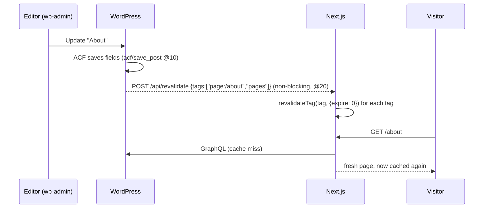
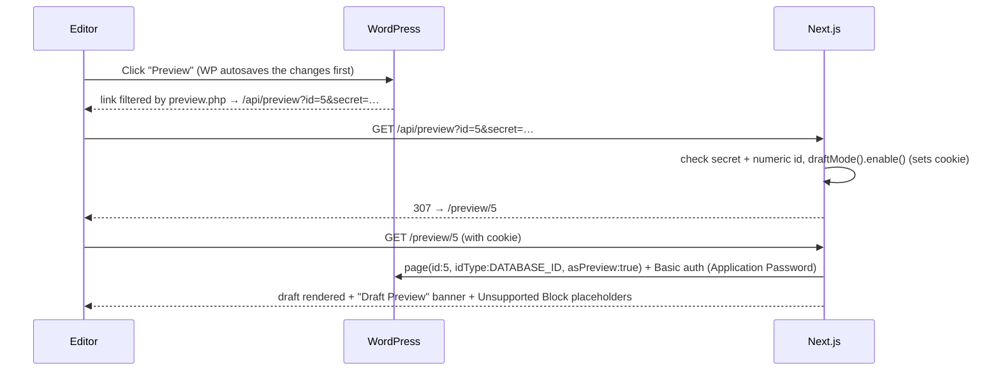

# Caching, revalidation and Draft Preview

## "An editor clicks Update. What happens?"

**Tags** (shared between `mu-plugins/revalidate.php` and `web/src/lib/cms/wordpress/tags.ts`):

| Tag | Put on | Revalidated when |
|---|---|---|
| `page:{path}` | `getPage(path)` | That Page is saved, unpublished or trashed |
| `pages` | `getAllPagePaths()` | Any Page is saved or unpublished |
| `globals` | `getGlobals()` | Site Settings saved, a menu saved, the front page changed |

**Why `{ expire: 0 }` and not the recommended `"max"`:** In Next 16, `revalidateTag(tag, "max")` marks data stale and serves the *old* version once while it refetches in the background (stale-while-revalidate). That's great for visitors, but an editor who clicks Update and refreshes would see their old content and think it failed. `{ expire: 0 }` makes the next request wait for fresh data. For a high-traffic site you might switch to `"max"`.

**Safety nets and limits:**
- `revalidate: 3600` on every fetch, so a missed webhook heals within an hour.
- The webhook is `blocking => false`, so a slow or down frontend never slows wp-admin.
- **Slug changes:** the *old* path's tag isn't revalidated. Its cached page lingers until the 1h revalidation, then 404s. Fix it by storing the previous path in `pre_post_update` and sending both tags.
- In production, Next.js on multiple instances needs a shared cache (Vercel handles this; self-hosted needs a cache handler such as Redis).

**Verified in this POC:** editing Home via WP-CLI without a webhook left the site cached. Firing `acf/save_post` hit `/api/revalidate` (from the ddev container via `host.docker.internal`), and the next request served the edit.

## Draft Preview

Key points:
- **Why a separate `/preview/[id]` route?** Drafts have no public URL yet, and reading `draftMode()` in the shared layout would turn *every* page dynamic. Keeping preview in its own route leaves public pages static.
- **Auth: Application Passwords** (built into WordPress since 5.6). There's a dedicated `headless-preview` user with the *editor* role, and `setup.sh` creates the password. Anonymous requests for the same draft return `null`. **The alternative is WPGraphQL JWT Authentication**: short-lived tokens and per-user previews, but it's another plugin with token refresh to manage.
- `asPreview: true` returns the latest autosave or revision, so it includes unsaved changes to a *published* Page.
- **Exit preview** is a Server Action that calls `draftMode().disable()`.
- `/preview/[id]` without the cookie returns 404, and a bad secret returns 401. Both were checked end to end.
